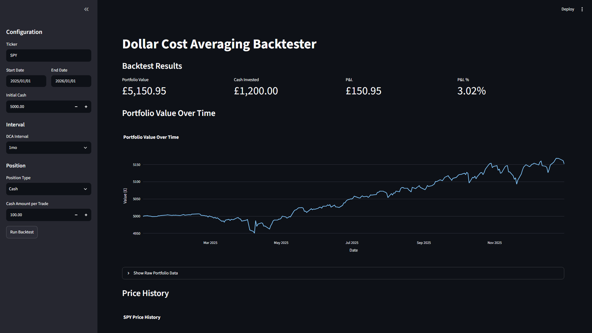
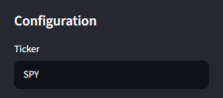
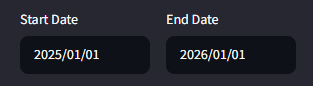
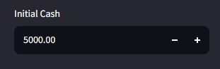
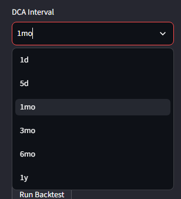
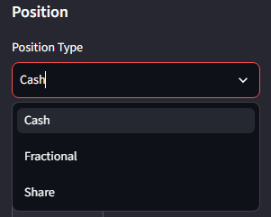

# Dollar Cost Average Backtester

The Dollar Cost Average Backtester provides a backtesting engine for the Dollar Cost Average investment strategy.

## Key Features
### Ticker Selection

Any ticker from the NYSE can be used.

### Backtest Period

You may backtest from any period, starting from `1962-01-02`, the earliest abailable `yfinance` 
data.

### Initial Cash

The initial cash can be set to any amount. This cash is used to buy shares.

### Interval

The buy interval can be set to the following:
* `1d`: 1 day
* `5d`: 5 days
* `1mo`: 1 month
* `3mo`: 3 months
* `6mo`: 6 months
* `1y`: 1 year 

### Position Type 

You may decide how you wish to invest your money:
* `Cash`: Invest a fixed amount of cash per trade.
* `Fractional`: Invest a fraction of your portfolio net worth per trade.
* `Shares`: Invest a fixed number of shares per trade.

## Installation
Download the repository and run `pip install -r requirements.txt` in the terminal.

## Usage
Run `streamlit run run.py` in the terminal.

## Project Structure
### `data.py`
Retrieves the relevant stock market data using the `yfinance` API and caches it in a SQLite database.
### `strategy.py`
Implements the Dollar Cost Average strategy.
### `portfolio.py`
Sets up the portfolio, monitoring the current cash and shares.
### `position_sizer.py`
Translates the position type and amount into a usable `float` to allocate cash to a buy order.
### `backtester.py`
Sets up and runs the backtesting engine.
### `analytics.py`
Calculates the backtest results.
### `run.py`
Runs the streamlit application to interface with the backtester.

## Tech Stack
**Frontend**: [Streamlit](https://streamlit.io/)

**Charts**: [Plotly](https://plotly.com/)

**Data Analysis**: [Pandas](https://pandas.pydata.org/)

**Data Source**: [yfinance](https://github.com/ranaroussi/yfinance)

**Database**: [SQLite3](https://sqlite.org/)